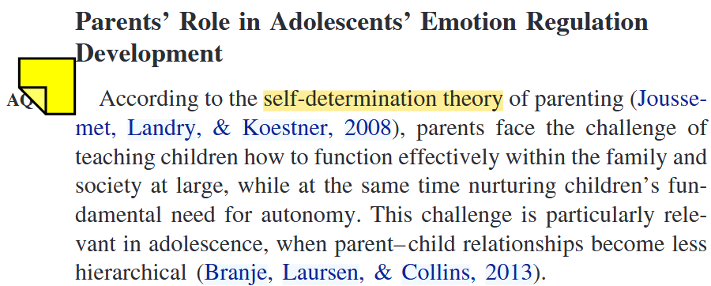
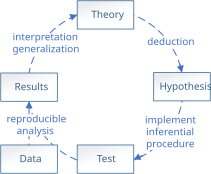
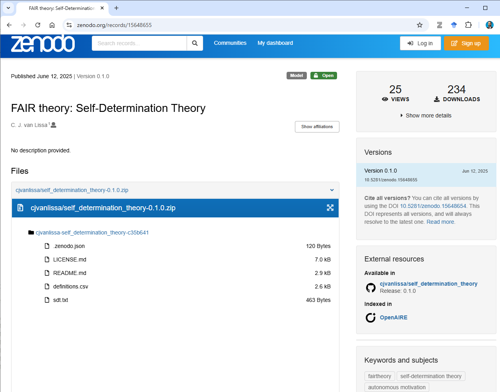

## Is your theory Useful?

> *"There's nothing as useful as a good theory"* (William James)

* What use does theory serve in my work? Nothing practical
* More like a "framework" to contextualize the work




---


## The Empirical Cycle




De Groot, 1963

---

## The Solution: FAIR Theory

* Open science practices have improved many areas of research
* Let's apply them to theory as well

[**F**]{.highlight}indability, [**A**]{.highlight}ccessibility, [**I**]{.highlight}nteroperability, and [**R**]{.highlight}euse of

[**information artifacts**]{.highlight}


---


## [F]{.highlight}indable 

- In standardized, FAIR-compliant repository, like Zenodo
- Indexed and searchable
- With metadata describing theory and its provenance
- DOI as persistent identifier

---

## [A]{.highlight}ccessible

- Plain text, human- and machine-readable file types
- Everyone knows how to, and ideally can, access the theory
- Independent from paper or book chapter

---

## [I]{.highlight}nteroperable

- Interoperability: the property of information artifacts to “integrate or work together [...] with minimal effort” (M. D. Wilkinson et al., 2016). 
-  Use formal, accessible, shared, and broadly applicable language for knowledge representation.
    + Lengthy prose/schematic drawings fall short of this
- X-interoperable: *how* is this theory interoperable *for what* purposes?

---

## [R]{.highlight}eusable {.center auto-animate="true"}

- Legally and practically reusable
- Appropriate (permissive) license

---

## FAIR Theory Utopia {.smaller}

* No more toothbrushes
	+ "[Theories are] like toothbrushes --- no self-respecting person wants to use anyone else’s" [@mischelToothbrushProblem2008; based on @watkinsModelsToothbrushes1984]
* Let a thousand flowers bloom: 
	+ "Progress in science depends on more than just a play of ideas; it requires the proliferation of theories and the acceptance of alternatives." (Feyerabend, 1970)
* But kill your darlings: 
	+ "theories [...] never die, they just slowly fade away." [@meehlTheoreticalRisksTabular1978]
* Theories have families, similar in form (analogical modeling) and similar in topic, but using different terms (jingle-jangle fallacies)
* Theories have a history, a full timeline of their ancestry and development
* Automatic tests can be run on all available datasets, pitting theories against each other in an ongoing manner (leaderboard/integration testing)

---

## Example: FAIR Self-Determination Theory {.smaller}

- **Proposition-Based Theory Specification (PBTS)** (Glöckner & Fiedler)
- SDT chapter: @deciSelfDeterminationTheory2012
- Coders identify **snippets**
- Translate to **IF–THEN** statements
- From IF–THEN to **DAG**

```{r eval = TRUE, echo = FALSE}
library(theorytools)
library(dagitty)
edges_raw <- structure(list(Nr = c(1L, 1L, 2L, 2L, 2L, 2L, 3L, 4L, 5L, 5L, 
6L, 7L, 7L, 8L), from = c("needs", "needs", "intrinsic_motivation", 
"intrinsic_motivation", "integration", "integration", "needs", 
"external_event", "external_event", "external_event", "locus_of_causality", 
"external_event", "external_event", "locus_of_causality"), to = c("intrinsic_motivation", 
"integration", "healthy_development", "wellbeing", "healthy_development", 
"wellbeing", "wellbeing", "intrinsic_motivation", "needs", "locus_of_causality", 
"intrinsic_motivation", "locus_of_causality", "needs", "intrinsic_motivation"
), form = c(NA, NA, NA, NA, NA, NA, NA, NA, NA, NA, NA, NA, NA, 
NA)), class = "data.frame", row.names = c(NA, -14L))


  #read.csv(system.file("sdt.txt", package = "theorytools"))
SDT <- unique(edges_raw[, 2:3])
SDT <- dagitty::dagitty(
  paste0("dag {",
  paste0(SDT$from, " -> ", SDT$to, collapse = "\n"),
  "}")
)
SDT
```

---

## Make It FAIR

Package SDT as a **FAIR theory**:


```{r eval=FALSE, echo = TRUE}
library(theorytools)
create_fair_theory(
  path = "SDT",
  title = "Self-Determination Theory",
  theory_file = c("sdt.txt", "definitions.csv"),
  remote_repo = "self_determination_theory",
  add_license = "cc0"
)
```

---

## On Zenodo




---


## Illustrating Interoperability

```{r eval = FALSE, echo=TRUE}
library(theorytools)
download_theory(https://doi.org/10.5281/zenodo.15648655)
```

---

## Interoperability: Plotting

```{r eval = FALSE, echo = TRUE}
tidySEM::graph_sem(SDT)
```

```{r eval = TRUE}
library(tidySEM)
library(ggplot2)
# Specify plot layout
lo <- get_layout(
"EE", "",   "IN", "WB",
"",   "LC", "",   "",
"NE", "",   "IM", "HD",
  rows = 3
)
# Rename nodes
renam <- c(EE = "external_event", NE = "needs", IN = "integration", WB = "wellbeing", 
           LC = "locus_of_causality", HD = "healthy_development", IM = "intrinsic_motivation")
lo[match(names(renam), lo)] <- renam
# Prepare the graph
p <- prepare_graph(SDT, layout = lo, angle = 179, text_size = 3, rect_width = 1.5, spacing_x = 2.5)

# Change node shape
p$nodes$shape <- "rect"
# Change node labels
renam <- c(external_event = "external\nevent", needs = "needs", integration = "integration", wellbeing = "wellbeing", 
           locus_of_causality = "locus of\ncausality", healthy_development = "healthy\ndev.", intrinsic_motivation = "intrinsic\nmotivation")
p$nodes$label <- renam[p$nodes$name]
# Plot the graph
plot(p)
```

---

## Interoperability: Control Variables

```{r echo=TRUE, eval = FALSE}
# Select covariates for causal inference
library(dagitty)
adjustmentSets(SDT,
               exposure="intrinsic_motivation",
               outcome="wellbeing")
#> { needs }
```

---

## Interoperability: Simulate Data

```{r echo=TRUE, eval = FALSE}
# Simulate data
simulate_data(SDT, n = 497)
```

```{r echo=FALSE, eval = TRUE}
# Simulate data
round(simulate_data(SDT, n = 5), 2)
```

---

## Interoperability: Power Analysis

```{r echo=TRUE}
sdt_coef <- dagitty('dag {
intrinsic_motivation -> wellbeing [beta=.4]
needs -> wellbeing [beta=.2]
}')

set.seed(1)
prop.table(
table(
replicate(
  n = 100,
  {
    df_sim <- simulate_data(sdt_coef, n = 200)
    summary(lm(wellbeing ~ ., df_sim))$coefficients[2, 4] < .05
  }
)
)
)
```

---


## References
